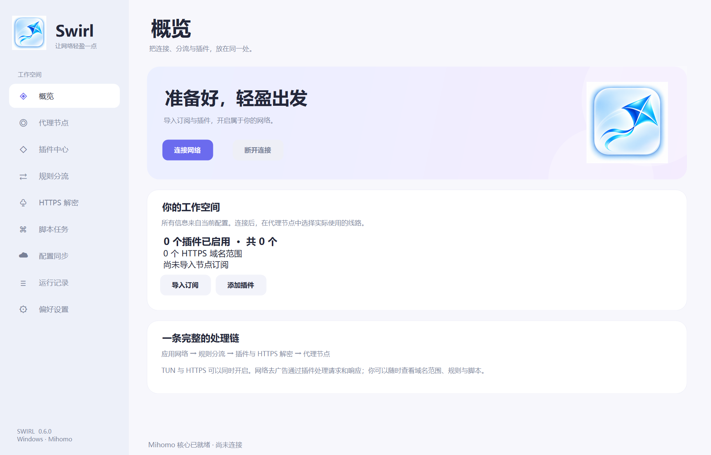

# Swirl


Windows x64 网络工具：Mihomo 代理、规则分流、Loon 明文插件兼容层、HTTPS 改写、JavaScript 脚本与加密配置同步。当前版本 **0.6.0**，支持 Windows 10 2004 及以上版本和 Windows 11，仅开发 Windows 版本。

界面采用浅色侧栏、圆角卡片、柔和渐变与独立功能页面，参考 macOS 网络工具的布局。图标使用用户提供的流光风筝。此项目由 AdShield 的网络模块继续开发，删除了爱奇艺和腾讯视频专用暂停广告识别与自动点击功能，广告处理由用户导入的网络规则和插件执行。



*空配置界面示例；截图未连接代理或启用插件。*

## 安装与开始使用

在 [Actions](https://github.com/SOLHK/Swirl/actions) 中打开最新成功的 **Build Windows EXE**，下载 `Swirl-Setup-win-x64` 安装程序或 `Swirl-win-x64` 便携包。安装程序名为 `Swirl_Setup_0.6.0_x64.exe`。安装程序包含 .NET 运行时、Mihomo、Wintun 与 jq，无需安装另一份 Clash 客户端。安装程序尚未代码签名。

1. 退出旧版。打开 Swirl，进入「节点」导入自己的 **Clash/Mihomo YAML** 或 HTTPS 订阅。软件不提供节点和订阅服务。
2. 在「总览」选择规则、全局或直连模式，启用系统代理并连接。节点策略组支持选择节点和测延迟。
3. 进入「插件」，从可莉目录选择、粘贴作者 HTTPS 链接、`loon://import?plugin=...` 链接，或导入本地明文 `.plugin/.lpx/.conf`。检查兼容提示、脚本和域名，再启用。含未支持语法的插件不能启用；导入和更新默认停用。
4. HTTPS 插件需要在「HTTPS」核对解密域名并主动信任本机证书，随后启用 HTTPS。普通系统代理不需要管理员；TUN 需要管理员。TUN 与 HTTPS 可以同时启用。
5. 停止连接后修改配置、插件和分流规则，再连接生效。退出或断开恢复由 Swirl 接管的系统代理，不覆盖用户或其他软件之后的修改。

数据保存在 `%LOCALAPPDATA%\Swirl`。首次启动在目标目录不存在时复制旧 `%LOCALAPPDATA%\AdShield\network`，保留原目录。旧证书可继续使用；未创建证书时生成 Swirl 命名的本机证书。订阅、节点配置、插件参数、脚本存储和证书密码由当前 Windows 用户 DPAPI 加密。

## 功能与边界

| 功能 | 当前实现 |
| --- | --- |
| 代理内核 | 独立 Mihomo v1.19.32；规则、全局、直连模式；本机控制接口随机口令 |
| 代理协议 | Clash/Mihomo 配置中的 SS、SS2022、SSR、VMess、VLESS、Trojan、Hysteria2、WireGuard、HTTP、HTTPS、SOCKS5 |
| 分流 | 导入 YAML 策略组及规则；自定义域名、域名后缀、IPv4/IPv6 网段、URL 正则、SSID；排序和启停 |
| SSID | 读取当前已连接 Wi-Fi，不扫描附近网络；连接时选取规则，切换 Wi-Fi 后重新连接生效 |
| URL 策略 | HTTP 和已指定解密域名的 HTTPS 请求可选择 DIRECT、REJECT、节点或策略组；仅规则模式；复写/请求脚本处理后的 URL 决定策略 |
| HTTPS / HTTP2 | 指定插件域名 MITM；实测 HTTP2 请求和响应正文、状态、头部、二进制脚本修改 |
| TUN + HTTPS | TUN TCP 80/443 经插件入口后交回核心；仅解密域名的 UDP 443 拒绝以回退 TCP；其他流量交由核心分流 |
| 插件参数 | input/select/switch、类型化默认值及本机加密覆盖值 |
| JavaScript | HTTP 请求/响应、手动通用脚本、Cron、网络变化脚本；单插件持久存储、有界计时器和 HTTP 助手 |
| 配置同步 | 加密便携导出/导入，用户选择同步文件夹后手动上传/下载；冲突提示、检查原始版本、保留加密历史 |

**这不是完整 Loon 复刻。** 基于 [Loon 插件](https://nsloon.app/docs/Plugin/)、[新版复写](https://nsloon.app/docs/Rewrite/rewrite_v2/) 和 [脚本接口](https://nsloon.app/docs/Script/script_api/) 实现的兼容层仍有如下边界：

- 不导入完整 Loon 配置或 Loon 专有节点格式。代理协议由 Mihomo 的 YAML 提供；协议配置通过核心验证不代表远端节点一定可连接。
- 不提供 Apple 客户端、原生 iCloud 账号同步或跨 Apple 平台功能。同步文件夹可以由用户已有的 OneDrive、iCloud Drive 等外部客户端同步；Swirl 不登录这些服务，也不自动覆盖远端配置。
- 未实现全部 Loon 专有配置/DNS API。HTTP 助手指定 `node` 等未支持选项会明确报告错误；通知记录在应用日志中。现代与旧版脚本/复写仍可能有未覆盖语法，导入时展示问题。
- 指定 **URL 分流域名**使用客户端 HTTP2 到源站 HTTP/1.1 的协议桥接，使同一连接中的不同 URL 可独立选择策略；这些源站须支持 HTTP/1.1。普通插件域名保留原生 HTTP2。HTTPS URL 分流需要证书和准确域名范围，不能只靠 TUN 看到加密路径。
- 正文脚本仅缓冲已知长度、不超过 **2 MB** 的非流式正文；视频、SSE、未知长度及超限正文跳过。插件错误、超时和超限保留可正常转发的原始流量；明确的 reject 或请求 `$done()` 可中止请求。
- 证书固定、不经过系统代理的客户端、Windows 与移动端不同的 API、广告与正文共用流等因素均可能影响去广告效果。导入某插件不等于已验证某个 Windows 视频客户端的拦截效果。
- TUN 捕获流量再次进入核心，不能保证保留原应用进程分流语义。测试验证了真实配置与模拟同名 TUN 入口链路，尚未安装开发电脑的实际 TUN 路由进行验证。

同步文件采用 AES-256-GCM 和 PBKDF2-SHA256（600,000 次），密码不保存。证书私钥、运行时文件、脚本持久存储不进入便携配置。导入先显示可审阅结果，应用后默认关闭 TUN/HTTPS 和插件，需用户主动开启。配置同步不会自动更新第三方插件或执行同步脚本。

## 插件兼容范围

- `[Rule]` 本地规则及 `[Remote Rule]` 远程文本规则、显式策略，`[Host]` 域名映射，`[MITM]` 通配域名与排除项。
- 旧版 Rewrite：reject 系列、302/307、URL 替换、请求/响应头、正文正则、jq/jq_file、内联与文件 Mock。
- 新版 Rewrite：URL、方法、状态、头部、参数的组合条件、命名捕获、顺序链和数组批量动作；URL/头部/正文正则、JSON 路径增删改、jq、Mock。
- HTTP 请求/响应脚本，类型化 `$argument`，`$request/$response/$done`，`$httpClient`、`$task.fetch`，文本与 Uint8Array 二进制正文、base64、gzip 和 AES 字节工具。
- 通用手动运行、五/六字段 Cron、网络变化触发；任务受超时、并发限制和取消控制，停止连接停止调度。远程资源只接受 HTTPS，导入/更新时下载并缓存，第三方插件不随包分发。

[可莉目录](https://hub.kelee.one/) 的文件按文本内容解析，`.lpx` 扩展名不阻止导入。下载遇到 403、HTML 或非明文内容会报告错误，可在浏览器取得原作者文件后本地导入。作者为移动客户端编写的插件不保证适配 Windows。

## 构建与验证

使用 **.NET 10 SDK / Windows Forms**；源码目录暂保留 `AdShield` 名称以方便追溯，输出应用和安装包均为 Swirl。

```powershell
dotnet run --project AdShield.Tests/AdShield.Tests.csproj -c Release
./scripts/prepare-core.ps1 -Destination AdShield.Tests/bin/Release/net10.0-windows10.0.19041.0/core
dotnet run --project AdShield.Tests/AdShield.Tests.csproj -c Release -- --network-tests
dotnet publish AdShield/AdShield.csproj -c Release -r win-x64 --self-contained true -p:PublishSingleFile=true -p:PublishTrimmed=false -o publish
./scripts/prepare-core.ps1 -Destination publish/core
```

本机完整回归 **180 项通过**：语法、参数、复写顺序、脚本、二进制/API、Cron、加密同步及冲突；真实核心 HTTP/HTTPS、原生 HTTP2 双向修改、同一 HTTP2 连接不同 URL 的命名策略；三模式模拟捕获入口、证书身份、隔离注册表恢复和 11 种协议离线配置验证。测试不改真实系统代理、不全局信任测试 CA、不安装 TUN 路由、不连接真实节点。另对九个页面进行 Windows DPI 截图检查。

HTTP2 正文处理包含针对固定 **Titanium.Web.Proxy 7.0.19** 的窄范围兼容修补，等待异步处理完成并仅对转发前、完整缓冲的正文修改内部状态；升级该依赖须重新验证。原生 HTTP2 及 URL 策略桥接有真实链路测试。

`scripts/prepare-core.ps1` 固定验证官方 Mihomo、Wintun 和 jq 下载哈希，随包附独立组件许可证和源码链接。Mihomo 与 jq 未修改，以独立进程运行；jq 禁止模块导入和系统环境变量，限制时间、内存及输入输出。NuGet 依赖为 YamlDotNet 16.3.0、Titanium.Web.Proxy 7.0.19、Jint 4.17.0。Swirl 与 Loon、MetaCubeX 无关联。用户的订阅、证书、视频截图和诊断数据不提交源码仓库。
