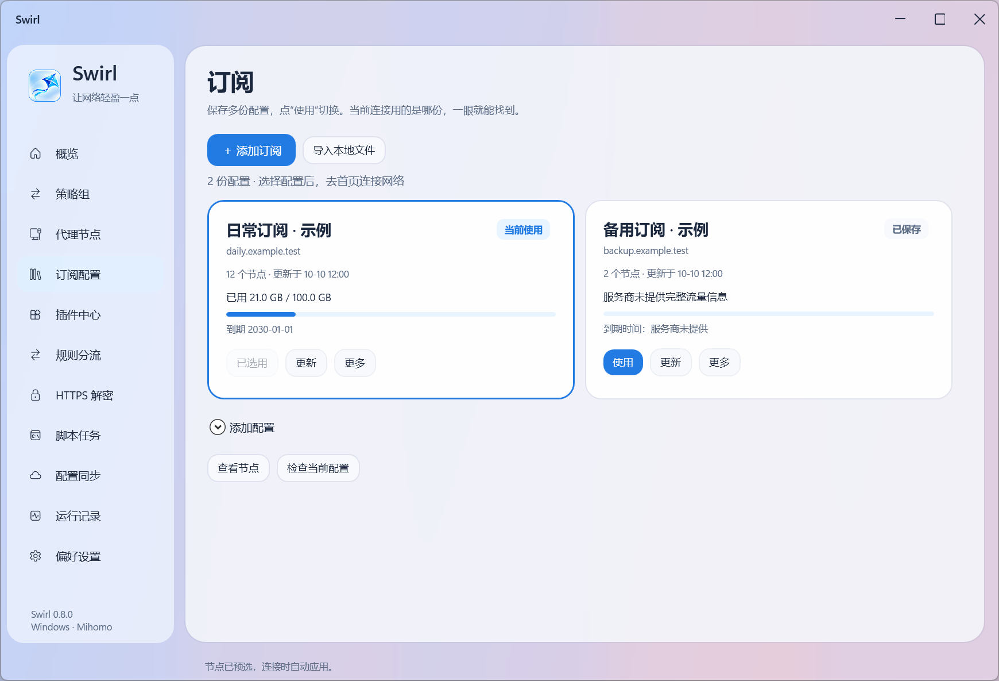
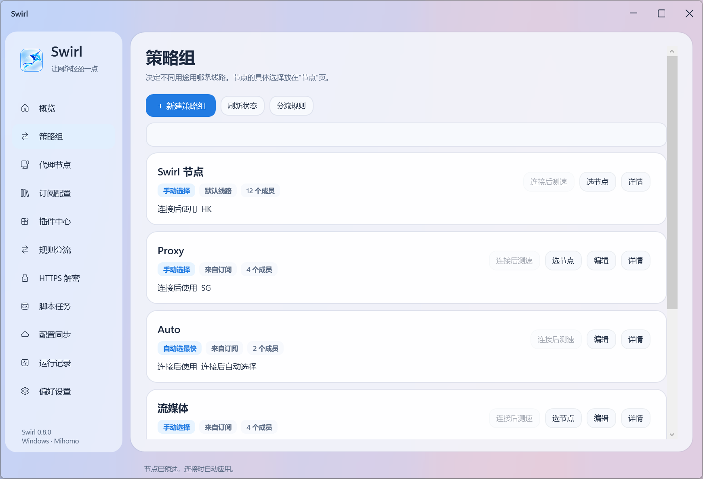
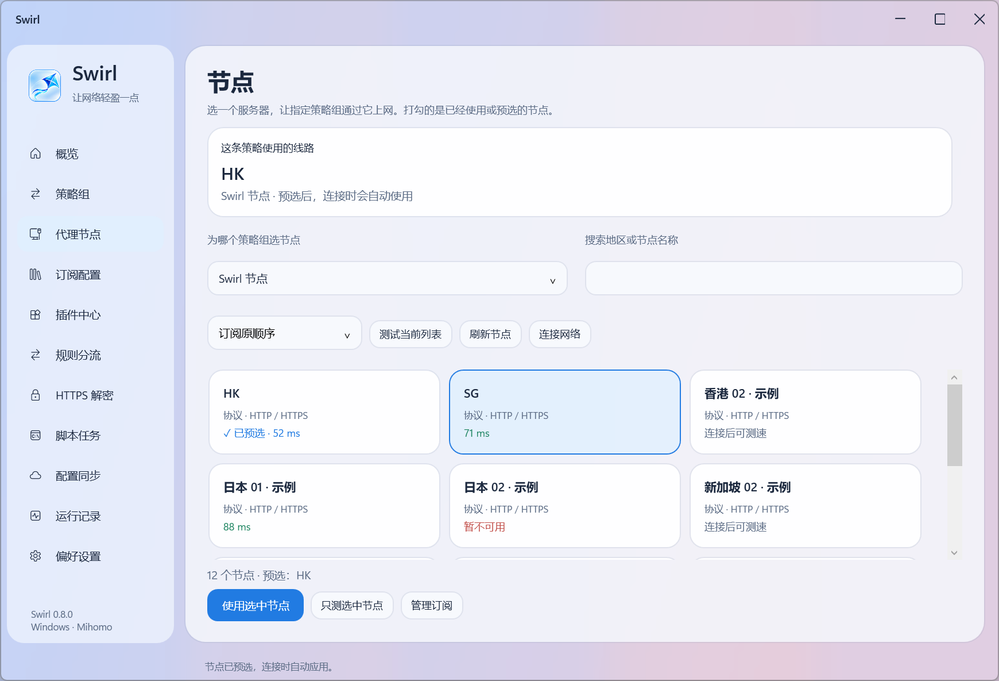

# Swirl

> **🧪 当前为 `test` 测试版分支，不是正式版。** 本分支用于 Windows 构建、Qt 6 Quick / QML UI 预览、修复和验收。独立 Qt 界面的功能操作目前使用模拟数据，不代表真实网络能力。**未经仓库所有者明确指令，禁止合并到 `main` 或发布正式版本。**
>
> [正式版 `main`](https://github.com/SOLHK/Swirl/tree/main) · [测试版 Qt CI](https://github.com/SOLHK/Swirl/actions/workflows/build-qt-quick-ui.yml) · [发布流程](docs/RELEASE_PROCESS.md)
>
> 


Windows x64 网络工具：Mihomo 代理、规则分流、Loon 明文插件兼容层、HTTPS 改写、JavaScript 脚本与加密配置同步。当前版本 **0.8.0**，支持 Windows 10 2004 及以上版本和 Windows 11，仅开发 Windows 版本。

界面使用 WPF 矢量渲染、原生 Windows 11 Desktop Acrylic 模糊背景、圆角玻璃侧栏和清晰的内容卡片，跟随系统浅色 / 深色设置。布局参考 macOS 的材质层次，控件与功能仍为 Windows 原生实现。图标使用流光风筝的透明背景版本，含 16–256 像素图标资源。整体布局借鉴网络工具的功能组织，并非 Loon macOS 界面的复刻。此项目由 AdShield 的网络模块继续开发，删除了爱奇艺和腾讯视频专用暂停广告识别与自动点击功能，广告处理由用户导入的网络规则和插件执行。


*截图使用示例订阅、模拟流量和延迟；未连接真实节点。淡色背景来自测试窗口，用于检查 Acrylic，并非内置壁纸。*

## 0.8.0 订阅库、策略组编辑与界面整理

订阅改为卡片库，支持保存多份配置、切换、更新、重命名、移除、独立下载选项与本地文件重新导入。每份配置分别保存节点选择和策略组修改。旧版保存的单份订阅自动进入订阅库。流量与到期时间来自服务商实际返回的 `subscription-userinfo`，没有数据时明确显示“未提供”；更新正在使用的订阅时标出“有更新待应用”，可点击按钮重新连接。

策略组按 [Loon 的常用用途](https://nsloon.app/docs/Policy/policygroup/)提供手动选择、自动选最快、故障转移、负载均衡四种方式。可以创建或编辑策略组、添加子策略、设置节点和提供器、筛选名称、调整优先顺序以及检测网址、间隔、超时、切换容差。设置转为真实 Mihomo 配置，保存前经过核心检查。自定义策略在订阅更新时保留；更新删除了仍被自定义策略使用的节点时，保留旧配置并提示调整成员。新策略组可在分流规则中使用，也可添加到其他策略组作为成员。

负载均衡提供同一网站固定节点、轮询、同一来源与目标保持节点三种核心方式。前两种对应类似 Loon PCC / Round-Robin 的用途；Loon 的 Random 随机算法未映射为其他算法，也未实现完整 Loon 配置导入。

节点使用卡片显示协议、预选或当前使用状态及真实延迟，支持搜索、排序、并行测速。未测速与暂不可用分别显示。节点和策略组继续使用独立页面；最小窗口中节点的使用按钮固定在底部，策略组编辑器的保存按钮也始终可见。





本机完整回归 330 项通过；新增验证包含旧订阅迁移、多订阅选择与加密同步、元数据解析、循环与失效成员校验，以及真实核心选最快、故障切换和轮询连接。桌面验证覆盖双订阅、未连接预选、策略组实际保存、下拉框、11 页与最小窗口。集成测试使用独立端口，可与已有 Swirl 连接同时运行。

## 0.7.2 节点选择与页面拆分

订阅配置、策略组、代理节点分成三个页面。导入订阅后立即显示本地节点和策略，可先预选节点再连接；远程提供器明确显示等待加载，连接后刷新真实节点。自动测速、故障转移和负载均衡策略也会显示，只有手动选择组接受切换。首页直接展示规则 / 全局 / 直连模式与最终节点；默认规则分流，运行时切换模式会重新连接，使系统代理和 TUN 使用同一套策略。

修复提供器专用配置被插入 DIRECT 占位的问题。核心启动后、接管系统代理前恢复有效的节点选择；全局策略默认选择有真实上游的线路。用户明确选择的 DIRECT 仍然保留。节点选择由当前用户 DPAPI 加密保存，重连恢复；订阅移除的节点不会被继续应用。便携配置同步也携带节点选择，并在接收设备重新加密。订阅规则中的国内直连或 `MATCH,DIRECT` 按原配置执行，规则模式不会变成全局代理。

新增真实 Mihomo 的选择 / 重启 / 提供器测试，以及桌面未连接预选、下拉框与最小窗口尺寸检查。界面保留 Swirl 的侧栏与 Acrylic 风格，使用示例订阅截图，不包含用户节点或订阅凭据。

## 0.7.1 订阅下载链路修复

订阅下载参考 [Clash Verge Rev 的下载链路选择](https://github.com/clash-verge-rev/clash-verge-rev/blob/dev/src-tauri/src/config/prfitem.rs) 和 [网络客户端实现](https://github.com/clash-verge-rev/clash-verge-rev/blob/dev/src-tauri/src/utils/network.rs)，将下载链路与 User-Agent、代理流量模式分开。支持自动、直连、当前手动系统代理和 Swirl 核心入口。自动模式先直连，网络连接失败或超时再尝试当前系统代理；HTTP 拒绝、HTML 验证页面、格式错误不会偷偷更换身份或转换服务。

修复 .NET 全局代理缓存的问题：直连明确关闭代理；系统代理在每次下载时读取 Windows 当前连接设置，避免切换代理客户端后继续连接已经关闭的旧端口。使用 Swirl 核心入口更新时可以保持连接，下载不经过插件改写；新配置保存后在重新连接时生效，当前连接使用独立的配置快照。

下载过程显示正在使用的链路，连接、DNS、HTTPS 隧道和 TLS 验证错误分别提示，仍保持证书验证、4 MB 上限及嵌套查询参数原样保留。用用户提供的实际订阅，在故意保持失效全局代理缓存的情况下验证：自动直连和最新系统代理都能下载有效 YAML，随后通过 Mihomo 配置检查；订阅及节点凭据没有提交仓库。
## 0.7.0 连接检查与 Windows 界面

系统代理改为使用 Windows 当前连接的原生设置接口，并在启动后读取有效设置确认接管成功；退出时恢复备份。核心启动与网络检测分别显示：两个 HTTPS 检测地址通过插件入口及 Mihomo 请求，网页或重定向不能冒充检测成功。节点页读取核心的实际选择，不再把列表首项当作已选线路。概览显示真实上传 / 下载累计流量与插件启用数量；未启用插件时明确提示去广告尚未配置。

主窗口改为 WPF，使用原生 Desktop Acrylic 显示背后窗口的模糊背景，支持圆角、系统主题、DPI 缩放与窗口缩放。系统关闭透明效果、高对比度或不支持的 Windows 版本使用清晰背景。安装程序使用独立的新图标路径更新桌面快捷方式，避免继续引用旧白底图标。

本次在 Windows Dev build 29648.1000 验证原生代理接管与界面。27H2 尚无本次可据以验证的正式版本；兼容按系统实际能力检测，不根据显示版本名称承诺。Windows 应用是否接受本机证书、插件是否覆盖该客户端的接口，仍以实际规则命中为准。
## 0.6.2 配置加载修复

旧安装包未包含 GEO 数据，首次连接遇到 GEOIP / GEOSITE 规则时依赖核心临时下载，下载失败会表现为“核心拒绝配置”。新版随包提供经过固定 SHA256 校验的 `geoip.metadb`、`GeoIP.dat`、`GeoSite.dat` 和 `ASN.mmdb`，首次检查前复制缺少的默认数据库；已有缓存和自定义 GEO 来源保留。常见分流数据库不再依赖首次联网下载。

节点页新增「检查配置」，使用和连接相同的运行配置与核心数据目录。连接失败显示分类原因、规则或节点数字索引及核心退出码，并记录到运行记录；不会原样输出订阅 URL、密钥或核心日志。数据目录和校验流程参考 [Clash Verge Rev 核心校验](https://github.com/clash-verge-rev/clash-verge-rev/blob/dev/src-tauri/src/core/validate.rs) 与 [运行数据资源处理](https://github.com/clash-verge-rev/clash-verge-rev/blob/dev/src-tauri/src/core/runtime_bundle.rs)。数据库来自 [MetaCubeX/meta-rules-dat](https://github.com/MetaCubeX/meta-rules-dat)，版本和校验值见 `scripts/geodata.json`。

## 0.6.1 订阅兼容修复

订阅下载改用专用客户端标识，默认 Mihomo / Clash Meta，也可在代理节点页选择 Clash 或浏览器请求。支持 HTTPS 原始链接、Clash/Clash Verge/Mihomo 的 install-config 一键链接和整串编码链接。完整订阅转换链接按原服务下载，保留嵌套查询参数，不发送给新的转换站。HTTP 403 发生在下载阶段；可切换请求类型重试。验证码、登录网页或通用 Base64 节点列表会明确提示，不会替换现有配置。有效的独立节点 provider payload 可转为本机 Clash 节点列表。

默认请求标识参考 [MetaCubeX 官方客户端](https://github.com/MetaCubeX/metacubexd)，一键链接格式参考 [Clash Verge 文档](https://www.clash-verge-rev.org/guide/url_schemes)。

## 安装与开始使用

在 [Actions](https://github.com/SOLHK/Swirl/actions) 中打开最新成功的 **Build Windows EXE**，下载 `Swirl-Setup-win-x64` 安装程序或 `Swirl-win-x64` 便携包。安装程序名为 `Swirl_Setup_0.8.0_x64.exe`。安装程序包含 .NET 运行时、Mihomo、Wintun 与 jq，无需安装另一份 Clash 客户端。安装程序尚未代码签名。

1. 退出旧版。打开 Swirl，进入「订阅配置」导入自己的 **Clash/Mihomo YAML** 或 HTTPS 订阅。软件不提供节点和订阅服务。
2. 在「偏好设置」启用系统代理或 TUN，并选择流量模式。在「概览」连接后查看 Windows 接管检查与 HTTPS 检测结果；在「代理节点」选择并应用线路。可在首页切换流量模式。全部直连模式不会使用代理节点，全局模式不应用普通分流规则。
3. 进入「插件」，从可莉目录选择、粘贴作者 HTTPS 链接、`loon://import?plugin=...` 链接，或导入本地明文 `.plugin/.lpx/.conf`。检查兼容提示、脚本和域名，再启用。含未支持语法的插件不能启用；导入和更新默认停用。
4. HTTPS 插件需要在「HTTPS」核对解密域名并主动信任本机证书，随后启用 HTTPS。普通系统代理不需要管理员；TUN 需要管理员。TUN 与 HTTPS 可以同时启用。
5. 停止连接后修改配置、插件和分流规则，再连接生效。退出或断开恢复由 Swirl 接管的系统代理，不覆盖用户或其他软件之后的修改。

数据保存在 `%LOCALAPPDATA%\Swirl`。首次启动在目标目录不存在时复制旧 `%LOCALAPPDATA%\AdShield\network`，保留原目录。旧证书可继续使用；未创建证书时生成 Swirl 命名的本机证书。订阅、节点配置、插件参数、脚本存储和证书密码由当前 Windows 用户 DPAPI 加密。

## 功能与边界

| 功能 | 当前实现 |
| --- | --- |
| 代理内核 | 独立 Mihomo v1.19.32；规则、全局、直连模式；本机控制接口随机口令 |
| 代理协议 | Clash/Mihomo 配置中的 SS、SS2022、SSR、VMess、VLESS、Trojan、Hysteria2、WireGuard、HTTP、HTTPS、SOCKS5 |
| 分流 | 导入 YAML 策略组及规则；自定义域名、域名后缀、IPv4/IPv6 网段、URL 正则、SSID；排序和启停 |
| SSID | 读取当前已连接 Wi-Fi，不扫描附近网络；连接时选取规则，切换 Wi-Fi 后重新连接生效 |
| URL 策略 | HTTP 和已指定解密域名的 HTTPS 请求可选择 DIRECT、REJECT、节点或策略组；仅规则模式；复写/请求脚本处理后的 URL 决定策略 |
| HTTPS / HTTP2 | 指定插件域名 MITM；实测 HTTP2 请求和响应正文、状态、头部、二进制脚本修改 |
| TUN + HTTPS | TUN TCP 80/443 经插件入口后交回核心；仅解密域名的 UDP 443 拒绝以回退 TCP；其他流量交由核心分流 |
| 插件参数 | input/select/switch、类型化默认值及本机加密覆盖值 |
| JavaScript | HTTP 请求/响应、手动通用脚本、Cron、网络变化脚本；单插件持久存储、有界计时器和 HTTP 助手 |
| 配置同步 | 加密便携导出/导入，用户选择同步文件夹后手动上传/下载；冲突提示、检查原始版本、保留加密历史 |

**这不是完整 Loon 复刻。** 基于 [Loon 插件](https://nsloon.app/docs/Plugin/)、[新版复写](https://nsloon.app/docs/Rewrite/rewrite_v2/) 和 [脚本接口](https://nsloon.app/docs/Script/script_api/) 实现的兼容层仍有如下边界：

- 不导入完整 Loon 配置或 Loon 专有节点格式。代理协议由 Mihomo 的 YAML 提供；协议配置通过核心验证不代表远端节点一定可连接。
- 不提供 Apple 客户端、原生 iCloud 账号同步或跨 Apple 平台功能。同步文件夹可以由用户已有的 OneDrive、iCloud Drive 等外部客户端同步；Swirl 不登录这些服务，也不自动覆盖远端配置。
- 未实现全部 Loon 专有配置/DNS API。HTTP 助手指定 `node` 等未支持选项会明确报告错误；通知记录在应用日志中。现代与旧版脚本/复写仍可能有未覆盖语法，导入时展示问题。
- 指定 **URL 分流域名**使用客户端 HTTP2 到源站 HTTP/1.1 的协议桥接，使同一连接中的不同 URL 可独立选择策略；这些源站须支持 HTTP/1.1。普通插件域名保留原生 HTTP2。HTTPS URL 分流需要证书和准确域名范围，不能只靠 TUN 看到加密路径。
- 正文脚本仅缓冲已知长度、不超过 **2 MB** 的非流式正文；视频、SSE、未知长度及超限正文跳过。插件错误、超时和超限保留可正常转发的原始流量；明确的 reject 或请求 `$done()` 可中止请求。
- 证书固定、不经过系统代理的客户端、Windows 与移动端不同的 API、广告与正文共用流等因素均可能影响去广告效果。导入某插件不等于已验证某个 Windows 视频客户端的拦截效果。
- TUN 捕获流量再次进入核心，不能保证保留原应用进程分流语义。测试验证了真实配置与模拟同名 TUN 入口链路，尚未安装开发电脑的实际 TUN 路由进行验证。

同步文件采用 AES-256-GCM 和 PBKDF2-SHA256（600,000 次），密码不保存。证书私钥、运行时文件、脚本持久存储不进入便携配置。导入先显示可审阅结果，应用后默认关闭 TUN/HTTPS 和插件，需用户主动开启。配置同步不会自动更新第三方插件或执行同步脚本。

## 插件兼容范围

- `[Rule]` 本地规则及 `[Remote Rule]` 远程文本规则、显式策略，`[Host]` 域名映射，`[MITM]` 通配域名与排除项。
- 旧版 Rewrite：reject 系列、302/307、URL 替换、请求/响应头、正文正则、jq/jq_file、内联与文件 Mock。
- 新版 Rewrite：URL、方法、状态、头部、参数的组合条件、命名捕获、顺序链和数组批量动作；URL/头部/正文正则、JSON 路径增删改、jq、Mock。
- HTTP 请求/响应脚本，类型化 `$argument`，`$request/$response/$done`，`$httpClient`、`$task.fetch`，文本与 Uint8Array 二进制正文、base64、gzip 和 AES 字节工具。
- 通用手动运行、五/六字段 Cron、网络变化触发；任务受超时、并发限制和取消控制，停止连接停止调度。远程资源只接受 HTTPS，导入/更新时下载并缓存，第三方插件不随包分发。

[可莉目录](https://hub.kelee.one/) 的文件按文本内容解析，`.lpx` 扩展名不阻止导入。下载遇到 403、HTML 或非明文内容会报告错误，可在浏览器取得原作者文件后本地导入。作者为移动客户端编写的插件不保证适配 Windows。

## 构建与验证

使用 **.NET 10 SDK / Windows Forms**；源码目录暂保留 `AdShield` 名称以方便追溯，输出应用和安装包均为 Swirl。

```powershell
dotnet run --project AdShield.Tests/AdShield.Tests.csproj -c Release
./scripts/prepare-core.ps1 -Destination AdShield.Tests/bin/Release/net10.0-windows10.0.19041.0/core
dotnet run --project AdShield.Tests/AdShield.Tests.csproj -c Release -- --network-tests
dotnet publish AdShield/AdShield.csproj -c Release -r win-x64 --self-contained true -p:PublishSingleFile=true -p:PublishTrimmed=false -o publish
./scripts/prepare-core.ps1 -Destination publish/core
```

本机完整回归 **330 项通过**：语法、参数、复写顺序、脚本、二进制/API、Cron、加密同步及冲突；真实核心 HTTP/HTTPS、原生 HTTP2 双向修改、同一 HTTP2 连接不同 URL 的命名策略；三模式模拟捕获入口、证书身份、隔离注册表恢复和 11 种协议离线配置验证。常规链路测试使用隔离代理设置，不全局信任测试 CA、不安装 TUN 路由。另有 --native-proxy-only 检查临时接管真实 Windows 当前连接，通过不显式指定代理的 WinINet 客户端验证入口，finally 恢复原代理、PAC、绕过列表和检测标志。十一个 WPF 页面在 Windows 150% DPI 下进行原生合成截图检查。

HTTP2 正文处理包含针对固定 **Titanium.Web.Proxy 7.0.19** 的窄范围兼容修补，等待异步处理完成并仅对转发前、完整缓冲的正文修改内部状态；升级该依赖须重新验证。原生 HTTP2 及 URL 策略桥接有真实链路测试。

`scripts/prepare-core.ps1` 固定验证官方 Mihomo、Wintun 和 jq 下载哈希，随包附独立组件许可证和源码链接。Mihomo 与 jq 未修改，以独立进程运行；jq 禁止模块导入和系统环境变量，限制时间、内存及输入输出。NuGet 依赖为 YamlDotNet 16.3.0、Titanium.Web.Proxy 7.0.19、Jint 4.17.0。Swirl 与 Loon、MetaCubeX 无关联。用户的订阅、证书、视频截图和诊断数据不提交源码仓库。
